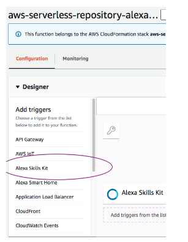
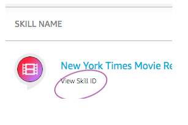

# How to add a trigger to alias

Make sure you go back and add trigger to PROD1

First click on Alexa Skills Kit

Then click on the Alexa Skills Kit that again appears on the right

Put in the Skill Id and click on Add

Skill ID can be found on the alexa developer console under the skill name

