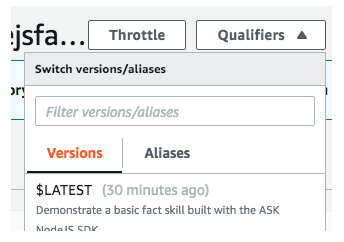
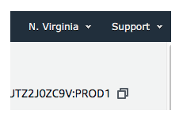
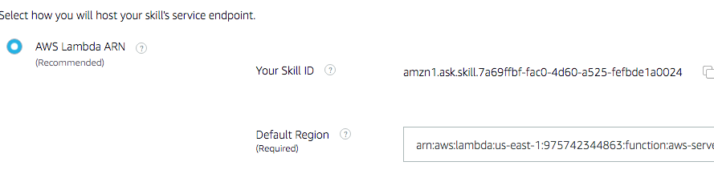

# How to include the new endpoint
Go to qualifiers



Select version 1

Immediately a new screen will appear, click on  the copy icon to get the arn id ending in PROD1



In your code, right before submission include this new endpoint.
If you are not using CLI, go to the endpoint tab in alexa skills console and paste this uri in *default region*



If using CLI:
Make sure to change the path of your Lambda function within your skill.json and .ask/config files

## In config file (under .ask)

```{
  "deploy_settings": {
    ...
        "lambda": [
    ...
            "arn": "arn:aws:lambda:us-east-1:965742344863:function:aws-serverless-repository-alexaskillskitnodejsfact-6AUTZ2J0ZC9V:PROD1",
            ….]
          }
```
## In skill.json
```{
  "manifest": {
    "apis": {
      "custom": {
        "endpoint": {
          "uri": "arn:aws:lambda:us-east-1:965742344863:function:aws-serverless-repository-alexaskillskitnodejsfact-6AUTZ2J0ZC9V:PROD1",
  ….  }
  ```
