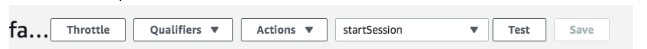

# How to create a version
In what follows, we will be focusing on the top bar:

This is where we have the options we will speak of below. We will use actions to create versions and aliases and qualifiers to select a version or an alias
. Let use assume that it is called version1

We then create an alias for version1 and give it any name we want <See how to make an alias>. Here we assume that the name is prod1.  We also need to add a trigger to the alias so that it is linked to Alexa skills kit and the skill id in question <See how to add a trigger to the alias>
