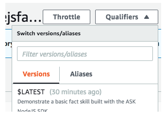

# How to point the alias to a new version 

Go to qualifiers and under Aliases pick PROD1

PROD1 is selected and the page reloads. Now scroll down to the Aliases section and change the version that PROD1 is pointing to. Now the new version is live. Since the same endpoint is being used (PROD1), there is no need to update the endpoint for the Alexa skill.

